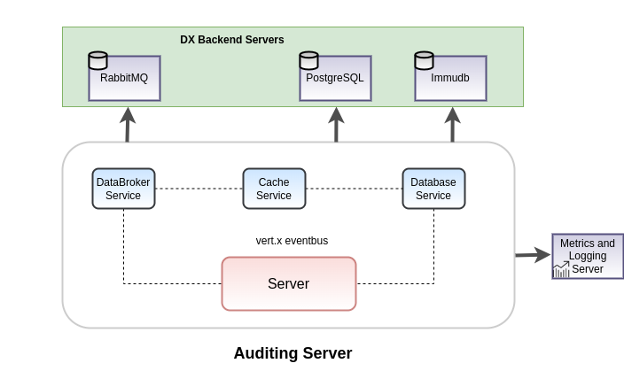

[%2520pipeline%2F)](https://jenkins.iudx.io/job/iudx%20auditing-server%20(v5.6.0)%20pipeline/lastBuild/)
[%2520pipeline%2F)](https://jenkins.iudx.io/job/iudx%20auditing-server%20(v5.6.0)%20pipeline/lastBuild/testReport/)
[%2520pipeline%2F)](https://jenkins.iudx.io/job/iudx%20auditing-server%20(v5.6.0)%20pipeline/lastBuild/jacoco/)

# DX Auditing Server

## Introduction

The Auditing Server is the data access logging server for dx.
It records detailed API access information across various dx components,
logging both the count of API call and volume of data accessed with each API call.
This enables data providers to identify which resources are being accessed and by whom.

## Features

- **Asynchronous Logging**: Efficiently logs API access details asynchronously, ensuring minimal impact on performance.

- **Immutable Logs**: Utilizes [immudb](https://immudb.io/) for tamper-proof, immutable logging of access records.

- **Fast Data Retrieval**: Supports quick read access with [PostgreSQL](https://www.postgresql.org/) to enhance data lookup speed.

- **Streaming Data Logging**: Monitors and logs data consumption for streaming data sources.

# Explanation
## Understanding Auditing Server
- The section available [here](./docs/Solution_Architecture.md) explains the components/services used in implementing the Auditing Server

# How To Guide
## Setup and Installation
- Setup and Installation guide is available [here](./docs/SETUP-and-Installation.md)

## FAQ
FAQs are available [here](./docs/FAQ.md)
