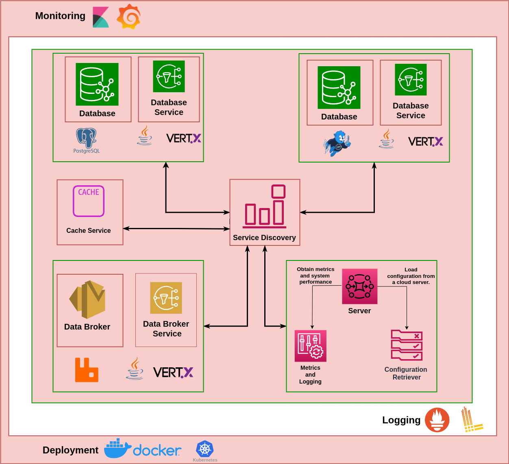

## Solution Architecture
The following block diagram shows different components/services used in implementing the DX Auditing Server.

The above setup allows specific high load containers/services to scale with ease. Various services of the server are detailed in the sections below.

### Immudb Service
ImmuDB is used on the server to ensure tamper-evident, immutable data storage, providing secure, verifiable audit logs that prevent undetected modifications. This guarantees data integrity for applications requiring high trust, such as auditing.

### Postgres Service
This Postgres service stores the same data as ImmuDB, providing faster read access in PostgreSQL for efficient data retrieval when needed.

### RabbitMq Service
This RabbitMq service publishes and consumes messages that are then processed to be stored in ImmuDB and PostgreSQL for reliable storage.

### Processor Service
The Processor Service handles processing of audit and subscription messages by building database queries, updating caches, and performing data insertion and rollback operations in PostgreSQL, ensuring data integrity and consistency across these databases.

### Cache Service
This service manages a cache of subscription user data, refreshing daily or on demand from PostgreSQL, to quickly serve access requests and improve response times by avoiding repeated database lookups.